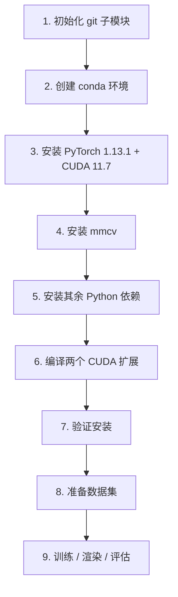

# EndoGaussian 环境配置指南

> 本指南基于当前机器的实际检测结果编写，目标是把 `/root/EndoGaussian` 仓库的运行环境完整搭建起来。
> 项目官方要求：**Python 3.7、PyTorch 1.13.1、CUDA 11.7**。

---

## 一、当前环境检测结果（实测）

| 项目 | 当前状态 |
| --- | --- |
| 操作系统 | Ubuntu 22.04 |
| GPU | ⚠️ **未检测到 GPU**（`nvidia-smi` 提示 `No devices were found`） |
| CUDA 编译工具 nvcc | ✅ 11.8 |
| GCC/G++ | ✅ 11.3.0 |
| Python | 3.10.8（仅 base 环境） |
| Conda | 22.11.1（仅 `base` 环境，无 `EndoGaussian` 环境） |
| PyTorch | 2.1.2+cu118（装在 base，**与官方要求的 1.13.1 不一致**） |
| mmcv | ❌ 未安装 |
| 子模块 `third_party/glm` | ❌ **缺失**（会导致 rasterizer 编译失败） |

> ⚠️ 两点提醒：
> 1. **必须使用 GPU 机型**：本项目训练依赖 CUDA，请确认你的云主机（如 AutoDL）已选择 GPU 实例并成功挂载显卡，否则编译能通过但无法运行。
> 2. **必须先初始化子模块**：`depth-diff-gaussian-rasterization` 依赖 glm 头文件，当前缺失，不初始化会编译报错。

---

## 二、配置流程总览



---

## 三、详细步骤

### 第 1 步：初始化 git 子模块（必须）

仓库里的 `depth-diff-gaussian-rasterization` 还依赖一个嵌套子模块 `glm`，当前缺失，必须先递归拉取：

```bash
cd /root/EndoGaussian
git submodule update --init --recursive
```

验证 glm 是否到位：

```bash
ls submodules/depth-diff-gaussian-rasterization/third_party/glm
```

> 如果输出提示 `No such file or directory`，说明子模块没拉成功，请重试上面命令，或手动克隆：
>
> ```bash
> git clone git@github.com:g-truc/glm.git \
>   submodules/depth-diff-gaussian-rasterization/third_party/glm
> ```

---

### 第 2 步：创建独立的 conda 环境

官方 README 用 Python 3.7，但部分依赖（如最新版 `open3d`）已不再支持 3.7，**推荐使用 Python 3.8**（更兼容，且仓库自带 cp38 的预编译 `.so`）。

```bash
conda create -n EndoGaussian python=3.8 -y
conda activate EndoGaussian
```

---

### 第 3 步：安装 PyTorch 1.13.1 + CUDA 11.7

```bash
pip install torch==1.13.1 torchvision==0.14.1 torchaudio==0.13.1 \
    --index-url https://download.pytorch.org/whl/cu117
```

> 说明：本机 nvcc 是 11.8，CUDA 向下兼容，torch 1.13.1 的 cu117 版本可以正常使用和编译。

---

### 第 4 步：安装 mmcv

代码里用 `mmcv.Config.fromfile()` 读取配置文件，只需纯 Python 的 `mmcv`（不需要 `mmcv-full` 的 CUDA 算子）：

```bash
pip install mmcv==1.6.0
```

> 如果上面失败（某些 Python 版本无对应轮子），可改用：
>
> ```bash
> pip install mmcv-full==1.6.0 -f https://download.openmmlab.com/mmcv/dist/cu117/torch1.13.0/index.html
> ```

---

### 第 5 步：安装其余 Python 依赖

`requirements.txt` 里已经包含 torch / mmcv，重复安装会被跳过，直接执行即可：

```bash
pip install -r requirements.txt
```

若想避免重复解析，也可以只安装 torch、mmcv 之外的包：

```bash
pip install matplotlib argparse lpips plyfile imageio-ffmpeg imageio open3d torchmetrics fpsample psutil
```

> ⚠️ 注意：`fpsample` 和 `psutil` 都不在官方 `requirements.txt` 里，但代码会用到：`scene/endo_loader.py` 需要 `fpsample`（`bucket_fps_kdline_sampling`），`render.py` 需要 `psutil`。缺失会报 `ModuleNotFoundError: No module named 'fpsample'` / `'psutil'`，务必一并安装。

---

> ⚠️ **重要提示**：执行第 6 步之前，请先确认 GPU 已挂载（`nvidia-smi` 能正常显示显卡）。否则 PyTorch 在编译 CUDA 扩展时会因探测不到显卡算力而报 `IndexError: list index out of range`。
>
> 若暂时没有 GPU，又想先编译，可手动指定目标显卡算力后再执行：
> ```bash
> export TORCH_CUDA_ARCH_LIST="8.6"   # 按实际显卡调整：3090=8.6，A100/A800=8.0，4090=8.9
> ```

### 第 6 步：编译安装两个 CUDA 扩展

```bash
pip install -e submodules/depth-diff-gaussian-rasterization
pip install -e submodules/simple-knn
```

编译较慢属正常现象。如果你的显卡算力已知，可先指定架构加速/避免自动检测失败（按需替换）：

```bash
# 常见显卡算力：RTX 3090 = 8.6，A100/A800 = 8.0，RTX 2080Ti = 7.5，RTX 4090 = 8.9
export TORCH_CUDA_ARCH_LIST="8.0"
pip install -e submodules/depth-diff-gaussian-rasterization
pip install -e submodules/simple-knn
```

---

### 第 7 步：验证安装

```bash
python -c "import torch; print('torch', torch.__version__, 'cuda_available', torch.cuda.is_available())"
python -c "import mmcv; print('mmcv', mmcv.__version__)"
python -c "from diff_gaussian_rasterization import _C; print('depth-diff-gaussian-rasterization OK')"
python -c "import torch; from simple_knn._C import distCUDA2; print('simple-knn OK')"
```

如果 `torch.cuda.is_available()` 为 `False`，说明 GPU 未挂载，需要回到云平台确认 GPU 实例已开机。

---

## 四、数据准备（可选，训练前需要）

本仓库不提供数据，需自行下载并按下面结构组织：

```
EndoGaussian/
├── data
│   ├── endonerf            # EndoNeRF 数据集（pulling / cutting 两个场景）
│   │   ├── pulling
│   │   └── cutting
│   ├── scared              # SCARED 数据集（需发邮件申请）
│   │   ├── dataset_1
│   │   │   └── keyframe_1/data
│   │   └── ...
│   └── hamlyn              # Hamlyn 数据集（来自 ForPlane）
│       └── hamlyn_seq1
```

- **EndoNeRF**：`git clone git@github.com:med-air/EndoNeRF.git`
- **SCARED**：https://endovissub2019-scared.grand-challenge.org/ （签署规则后发邮件获取下载链接），并用 `git clone git@github.com:EikoLoki/MICCAI_challenge_preprocess.git` 预处理
- **Hamlyn**：`git clone git@github.com:Loping151/ForPlane.git`

---

## 五、训练 / 渲染 / 评估（快速开始）

以 `pulling_soft_tissues` 场景为例：

```bash
# 训练
python train.py -s data/endonerf/pulling --port 6017 \
    --expname endonerf/pulling \
    --configs arguments/endonerf/pulling.py

# 渲染（可选，--skip_train 等可跳过对应集合）
python render.py --model_path output/endonerf/pulling \
    --skip_train --skip_video \
    --configs arguments/endonerf/pulling.py

# 评估指标
python metrics.py --model_path output/endonerf/pulling
```

> 每个场景对应的配置文件在 `arguments/` 目录下（`endonerf/`、`scared/`），可自行修改训练参数。

---

## 六、常见问题（FAQ）

**Q1：编译 rasterizer 时报 `glm/glm.hpp: No such file or directory`**
→ 子模块没拉全，回到第 1 步执行 `git submodule update --init --recursive`。

**Q2：`nvidia-smi` 显示 No devices were found**
→ 当前是 CPU 容器或 GPU 未挂载，请切换/开机 GPU 实例后再继续。

**Q3：`pip install open3d` 在 Python 3.7 下失败**
→ 用 Python 3.8 重建环境（见第 2 步），或固定旧版：`pip install open3d==0.16.0`。

**Q4：nvcc 版本 11.8 但官方要求 11.7**
→ CUDA 向下兼容，无需重装，正常使用即可；编译时的版本警告可忽略。

**Q5：`mmcv` 安装失败**
→ 按第 4 步改用 `mmcv-full==1.6.0` 的 cu117/torch1.13.0 轮子。

**Q6：torch 1.13.1 装完还是 CPU 版**
→ 确认用了 `--index-url https://download.pytorch.org/whl/cu117`，并检查 `torch.cuda.is_available()`。

**Q7：验证 simple_knn 时报 `ImportError: libc10.so: cannot open shared object file`**
→ 这是导入顺序问题：`simple_knn` 的 `__init__.py` 是空的，不会先加载 torch，而扩展依赖的 `libc10.so` 又不在系统搜索路径。解决：先 `import torch` 再导入扩展，即 `python -c "import torch; from simple_knn._C import distCUDA2"`。

**Q8：训练时报 `ModuleNotFoundError: No module named 'fpsample'`**
→ `fpsample` 不在官方 `requirements.txt` 中，但 `scene/endo_loader.py` 用到它。解决：`pip install fpsample`（当前验证可用版本 1.0.2）。

**Q9：渲染时报 `ModuleNotFoundError: No module named 'psutil'`**
→ `psutil` 不在官方 `requirements.txt` 中，但 `render.py` 用到它。解决：`pip install psutil`。
